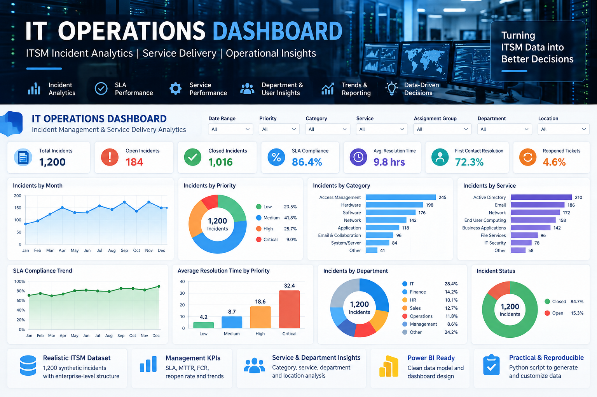
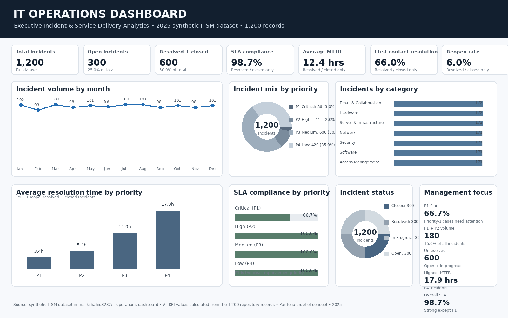

# IT Operations Dashboard



> **Illustrative dashboard showcase using synthetic ITSM data.** The KPI values in this visual are presentation examples; the repository dataset and future Power BI implementation provide the authoritative project data.

## Executive Dashboard



> **Executive Dashboard — KPIs and visuals calculated directly from the 1,200-record synthetic ITSM dataset in this repository.**

### Verified Portfolio KPIs

| KPI | Value |
|---|---:|
| Total incidents | 1,200 |
| Open incidents | 300 |
| Resolved + closed | 600 |
| SLA compliance* | 98.7% |
| Average MTTR* | 12.4 hours |
| First Contact Resolution* | 66.0% |
| Reopen rate* | 6.0% |
| P1 + P2 incidents | 180 |

* Calculated for resolved and closed incidents where applicable.

> Professional Proof of Concept | ITSM | Service Delivery | Incident Analytics | Management Reporting

A synthetic IT Service Management (ITSM) dataset and dashboard-ready project designed to demonstrate how operational ticket data can be transformed into management-level insights.

**Author:** Shahid Al Parvez Malik  
**Positioning:** Senior IT Infrastructure & Service Delivery Manager | IT Operations | ITSM | Automation | AI

## Purpose

This project demonstrates a practical approach to IT Operations reporting using a simulated enterprise Service Desk environment.

It focuses on:

- Incident volume and trends
- SLA compliance
- Mean Time to Resolve (MTTR)
- Priority and category analysis
- First-contact resolution
- Reopened incidents
- Service and department impact
- Management-oriented operational KPIs

> **Important:** All data in this repository is synthetic and created for demonstration purposes. No confidential, employer, customer, or production data is included.

## Business Questions

The dashboard is designed to help an IT Operations leader answer:

1. How many incidents are we handling?
2. Are we meeting our SLA commitments?
3. Which services generate the most operational demand?
4. Which incident categories consume the most support effort?
5. Which priorities are driving business risk?
6. What is our average resolution time?
7. How often are incidents reopened?
8. Which departments or locations are experiencing recurring issues?
9. Where should management focus improvement efforts?

## KPI Definitions

| KPI | Definition |
|---|---|
| Total Incidents | Count of incidents in the reporting period |
| Open Incidents | Incidents not yet resolved or closed |
| SLA Compliance | Percentage of resolved incidents completed within target SLA |
| MTTR | Average elapsed time from incident creation to resolution |
| First Contact Resolution | Percentage resolved at the first support interaction |
| Reopen Rate | Percentage of resolved incidents subsequently reopened |
| High-Priority Incidents | Count of P1/P2 incidents |
| Incident Volume | Number of incidents by period, service, category, location or department |

## Suggested Dashboard Pages

### 1. Executive Overview
- Total incidents
- Open incidents
- SLA compliance
- MTTR
- FCR
- Reopen rate
- P1/P2 volume
- Monthly incident trend

### 2. Service Performance
- Incidents by business service
- SLA compliance by service
- MTTR by service
- Top recurring services

### 3. Operational Analysis
- Category distribution
- Priority distribution
- Assignment group performance
- Location and department trends

### 4. Improvement Opportunities
- Reopened incidents
- Repeated categories
- SLA breaches
- Long-resolution incidents
- Potential problem-management candidates

## Data Model

The current proof of concept uses a single incident fact table. A future version can separate it into a star schema:

```text
                 DimDate
                    |
DimService -- FactIncident -- DimPriority
                    |
              DimCategory
                    |
             DimDepartment
                    |
               DimLocation
```

## Repository Structure

```text
it-operations-dashboard/
├── README.md
├── LICENSE
├── .gitignore
├── data/
│   ├── README.md
│   └── incidents.csv
├── scripts/
│   └── generate_incidents.py
└── docs/
    ├── KPI_DEFINITIONS.md
    ├── DASHBOARD_DESIGN.md
    └── DATA_DICTIONARY.md
```

## Reproducibility

Generate a fresh synthetic dataset:

```bash
python scripts/generate_incidents.py
```

The script uses a fixed random seed by default so results are reproducible.

## Power BI

The CSV file can be imported directly into Power BI Desktop.

Recommended measures:

```DAX
Total Incidents = COUNTROWS(Incidents)

Resolved Incidents =
CALCULATE(
    COUNTROWS(Incidents),
    Incidents[Status] IN {"Resolved", "Closed"}
)

SLA Compliance % =
DIVIDE(
    CALCULATE(
        COUNTROWS(Incidents),
        Incidents[SLA Met] = "Yes"
    ),
    [Resolved Incidents]
)

Average MTTR Hours =
AVERAGE(Incidents[Resolution Hours])

First Contact Resolution % =
DIVIDE(
    CALCULATE(
        COUNTROWS(Incidents),
        Incidents[First Contact Resolution] = "Yes"
    ),
    [Resolved Incidents]
)

Reopen Rate % =
DIVIDE(
    CALCULATE(
        COUNTROWS(Incidents),
        Incidents[Reopened] = "Yes"
    ),
    [Resolved Incidents]
)
```

> These measures are illustrative. Validate business rules and filter context before using them in production.

## Professional Relevance

This project demonstrates the connection between:

**ITSM → Operational Data → KPI Analysis → Management Insight → Continuous Improvement**

It is intentionally designed around IT Operations leadership rather than generic software development.

## Future Enhancements

- Power BI `.pbix` implementation
- Automated daily data refresh
- SLA breach prediction
- Incident clustering
- Problem-management candidate detection
- AI-assisted ticket summarization
- Automated management reporting
- Service availability and change correlation

## Disclaimer

This repository is a portfolio demonstration and not a production ITSM platform. It contains synthetic data only.
